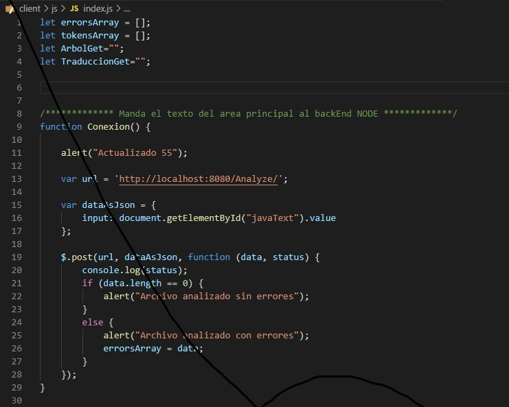

# Manual Técnico

El pograma cuenta con 2 carpetas: client: <frontEnd> y server: <backEnd>
Cada carpeta contiene sus respectivas clases para su análisis.

# Carpeta client

Esta carpeta contiene el servidor de Go y la página HTML que es levantada.
También cuenta con estas sub-carpetas:

  - CSS
  - JS

La carpeta CSS contiene el archivo .css que le da estilo y color a la página HTML.
La carpeta JS contiene 2 archivos, de los cuáles el archivo index.js es detallado a continuación.

En este archivo, se manejan los métodos para descargar archivos, guardar y también los métodos pos que serán enviados al servidor del backEnd para luego recibir su respuesta.

# Carpeta server

Esta carpeta contiene 4 clases principales que son las encargadas del manejo completo del analizador JS.
 - gramatica.jison
 - arbolNodo
 - arbolRecorrido
 - server
 
### clases del árbol

Estas dos clases son las que crean los nodos y el recorrido del árbol AST para luego mandarlo al servidor cliente como respuesta y que él lo convierta en formato d3-graphviz.

### clase gramatica.jison
Esta clase es la encargada de analizar el texto de entrada y recopilar los errores léxicos y sintácticos para luego mandarlos al servidor del cliente y retornarlos en un área de texto.

Al inicio de esta clase, se declaran los arrays de errores, clases a utilizar y los tokens a reconocer. También en cada producción, se le inserta un nodo al AST y se le insertan los tokens reconocidos para también mandarlos al server. Cada producción cuenta con su llamado a la producción error, que es la encargada de ejecutar el modo pánico para la recuperación de errores sintácticos.

### clase server.js

Esta clase es la encargada de recibir y mandar las respuestas al lado de Go.
La clase server.js cuenta con varios métodos tipo .POST que son las que manipulan para que el código compile correctamente.

# Gramatica utilizada

# Comandos a instalar

Antes de iniciar el programa, se deben ejecutar los siguientes comandos:
 - npm install typescript -g
 - npm install express -g
 - npm install cors -g
 - npm body-parser -g
 - npm install jison -g
 - npm install typescript -require

También, antes de iniciar el proyecto, se deben ejecutar las siguientes acciones en orden:
 - npm init --yes
 - npm i express morgan cors
 - node server.js
Y con esto, el servidor del backEnd ya esta levantado.

Para levantar el servidor de Go, ejecutar los siguientes comandos:
 - go run hello.go

# Requerimientos minimos del sistema para Visual Studio Code

