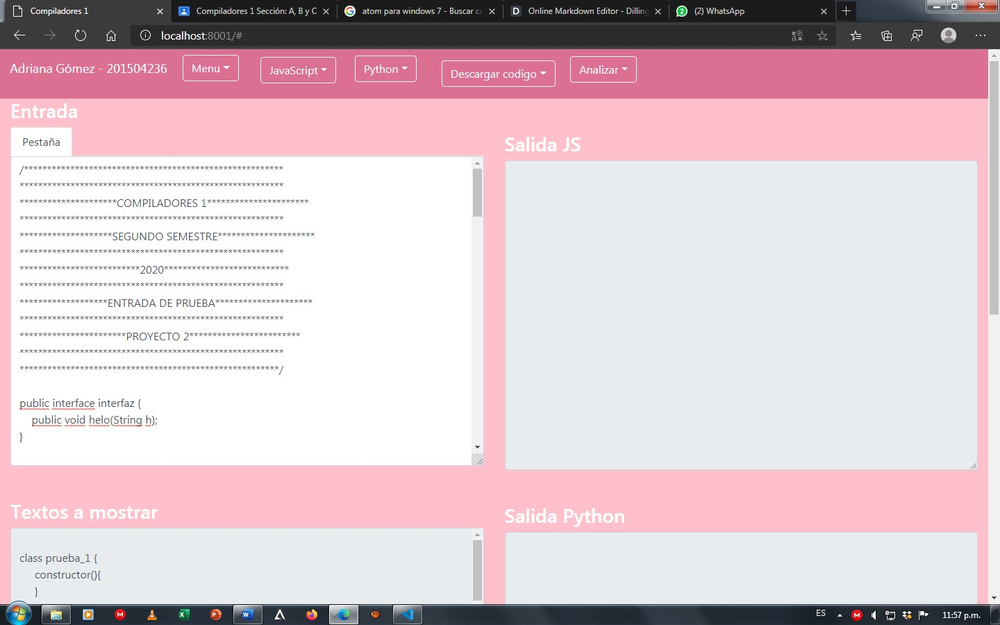
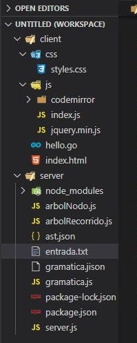

# Manual de Usuario

En la ventana del programa, se encuentran 5 botones en la parte superior, seguido de 5 áreas de texto en el centro.
A cada boton se le despliegan más opciones.
  - Menú
  - JavaScript
  - Python
  - Descargar código
  - Analizar

# Botones

Menú:
  - Cargar archivo
  - Guardar archivo
  - Nueva pestaña
Estas opciones nos permiten cargar archivos con cualquier extensión al área de texto principal, guardar archivos, descargarlos y crear pestañas para un manejo simultáneo en varios archivos.

JavaScript:
  - Mostrar tokens
  - Mostrar errores
  - Mostrar árbol
  - Descargar árbol
  - Descargar código
Estas opciones nos permiten mostrar los tokens, errores, árbol y código traducido del lenguaje JavaScript. También nos permite descargar el árbol con extensión .html para visualizarlo mejor.

Python:
  - Mostrar tokens
  - Mostrar errores
  - Mostrar árbol
  - Descargar árbol
  - Descargar código
Estas opciones nos permiten mostrar los tokens, errores, árbol y código traducido del lenguaje Python. También nos permite descargar el árbol con extensión .html para visualizarlo mejor.

Descargar código:
  - Ambos
  - JavaScript
  - Python
Estas opciones nos permiten descargar los códigos traducidos de ambos lenguajes con sus respectivas extensiones.

Analizar:
  - JavaScript
  - Python
Estas opciones nos permiten analizar los archivos de entrada y mandarlos al servidor del backend para su respectivo retorno esperado, este botón debe ejecutarse antes de cualquiera de las de arriba.

# Áreas de texto

* Entrada:
En esta área de texto se visualizarán todos los archivos cargados con cualquier extensión.

* Salida JS:
En esta área de texto se visualizarán todos los errores léxicos y sintácticos del lenguaje analizado JavaScript.

* Salida Python:
En esta área de texto se visualizarán todos los errores léxicos y sintácticos del lenguaje analizado Python.

* Listado de tokens:
En esta área de texto se visualizarán todos los tokens reconocidos de ambos lenguajes analizados.

* Textos a mostrar:
En esta área de texto se visualizarán los códigos del árbol y los códigos traducidos antes de descargarlos.

# Archivo de entrada sin errores

